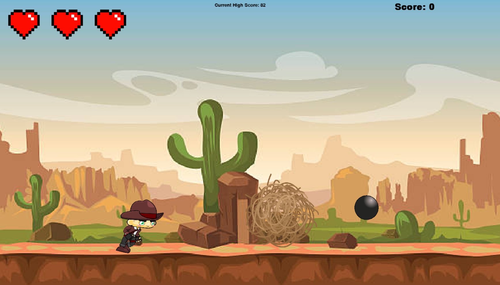
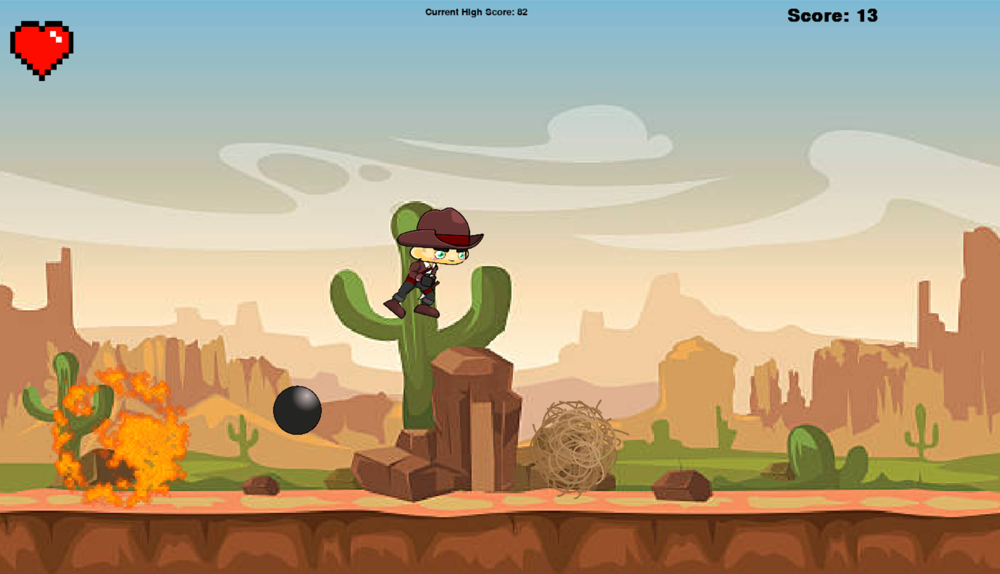

# Description 

*unfortunately, the pygame library must be installed on your computer if you want to play this game*

This is a game that i developed over the winter break as an introductory project to learning about the pygame module in python. 

This game is an obstacle dodging game where the user plays as a cowboy and must stay alive for as long as possible to get the highest score. The game keeps track of the score and saves a highscore locally. The player also loses a heart whenever the cowboy is hit and after all hearts are gone the game is over.

The cowboy's movements (idle, running, sliding) are animated by playing image sprites shortly after one another at 30 frames per second. The same concept is used to animate 3 distinct obstacle objects which the player must dodge. They are a cannon shot, rolling tumbleweeds, and bombs that drop from above. In order to keep the player more alert, certain attributes of the obstacles are randomized as they are created (eg, the speed and size can be random).

